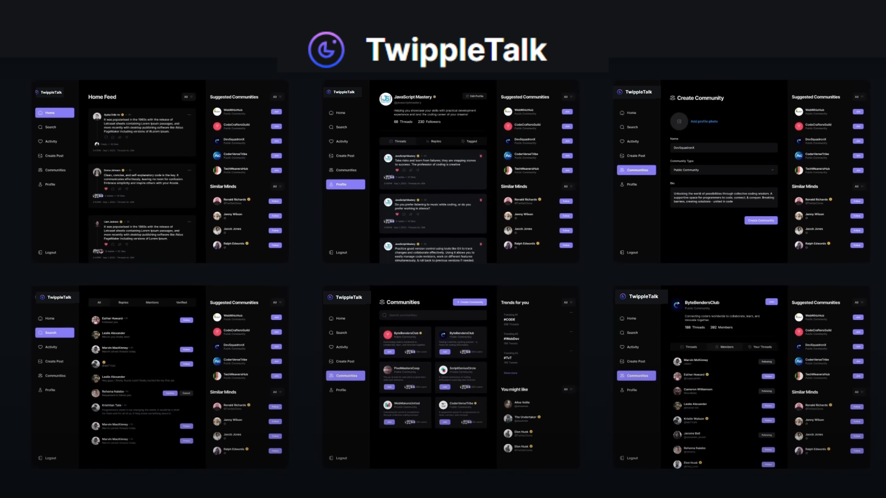
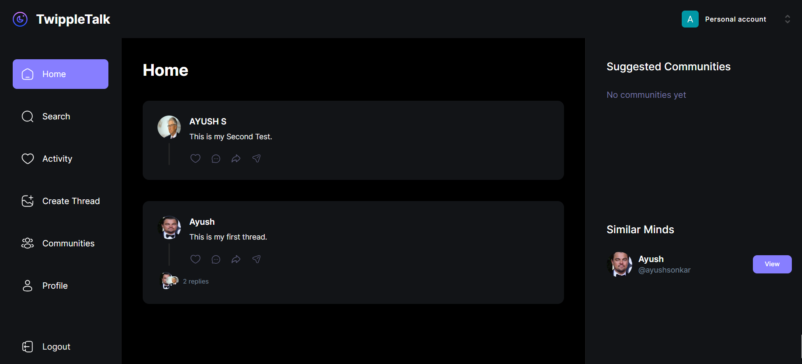
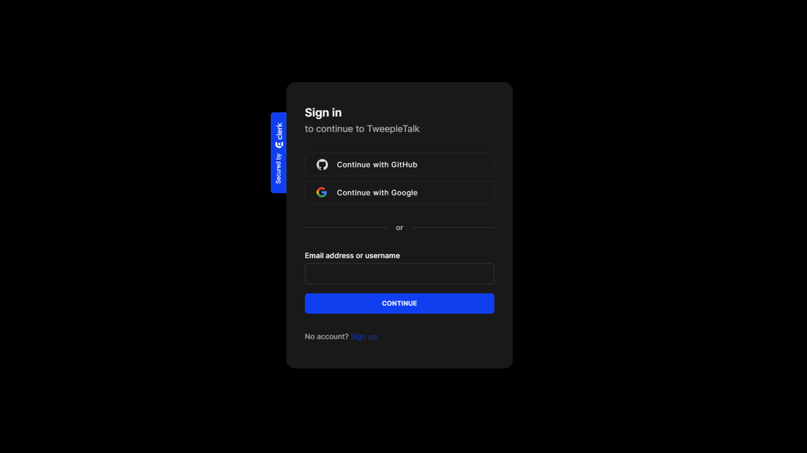
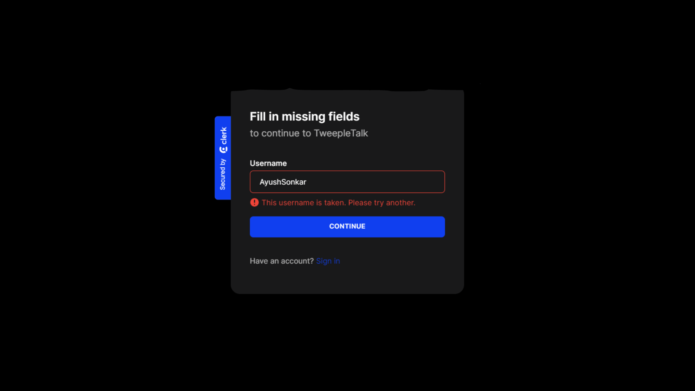
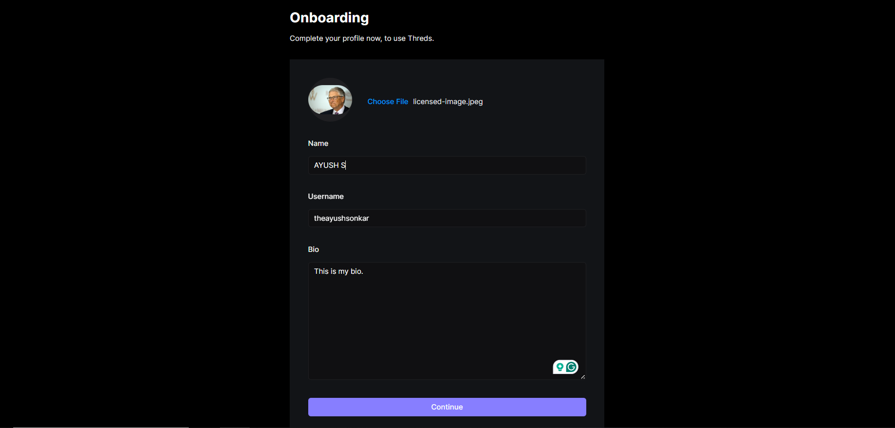
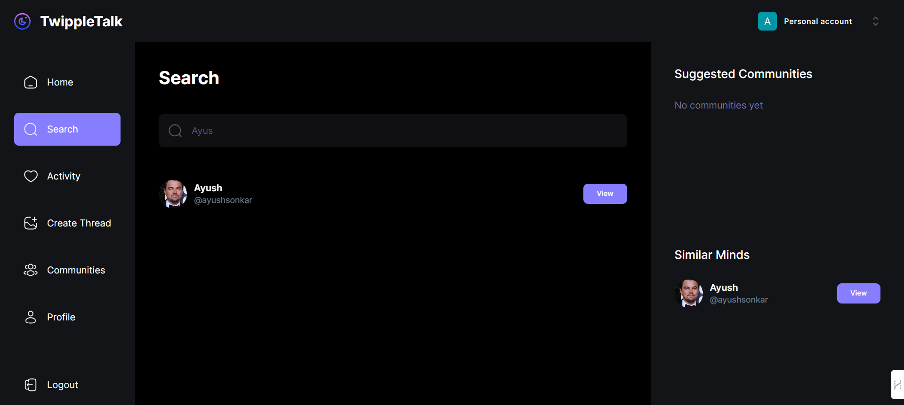
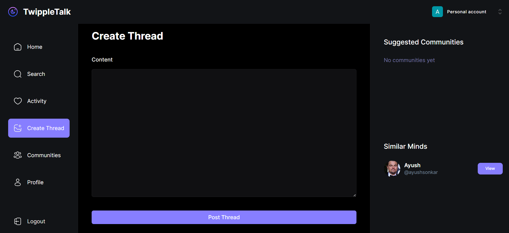
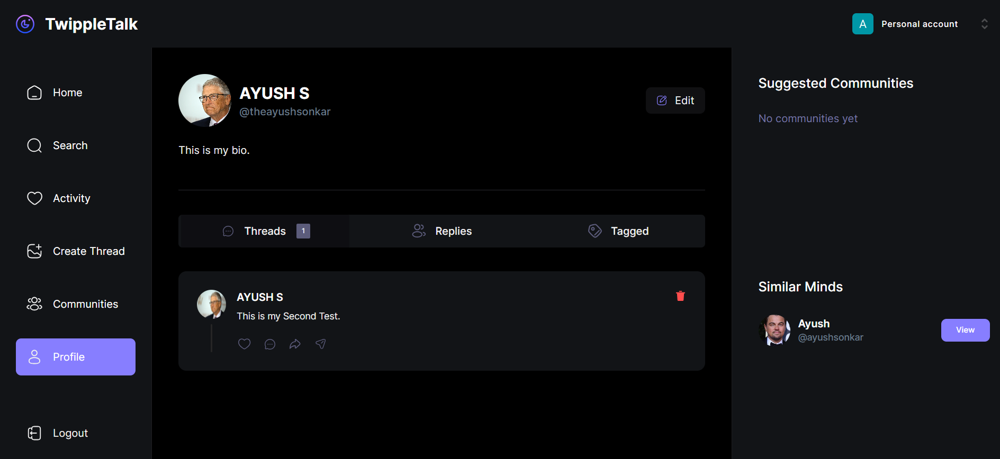

# TwippleTalk

TwippleTalk is a text-centric social media platform designed to enable users to create and engage in threaded discussions. It provides a platform for users to share their thoughts, ideas, and opinions in a structured and organized manner.




## Screenshots

### Home


### Sign In




## Onboarding Page



### Search


### Create Thread


### Profile



## Features

- Users can create threads and engage in discussions with other users.
- Authentication procedures have been revamped to adopt Clerk’s password-less, secure, and scalable approach.
- Three distinct authentication options are available: Google, GitHub, and Username.
- Seamless integration of file uploads using UploadThing, providing file hosting, server-side authorization, and enhancing the overall client experience.


## Installation

Clone the repository: 
```bash
  git clone https://github.com/theayushsonkar/TwippleTalk.git
```
Navigate to the project directory:
```bash
  cd TwippleTalk
```
Install dependencies: 
```bash
  npm install
```
Start the development server: 
```bash
  npm run dev
```
Open your browser and navigate to http://localhost:3000 to access TwippleTalk.

## Usage
- Sign up or log in using one of the available authentication options.
- Create threads to start discussions or engage in existing threads.
- Upload files to enrich your discussions and interactions.
- Enjoy the text-centric social experience offered by TwippleTalk.
    
